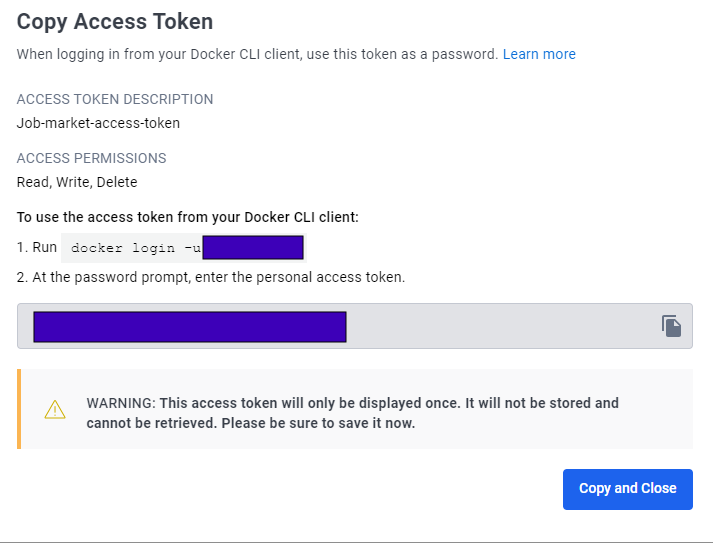
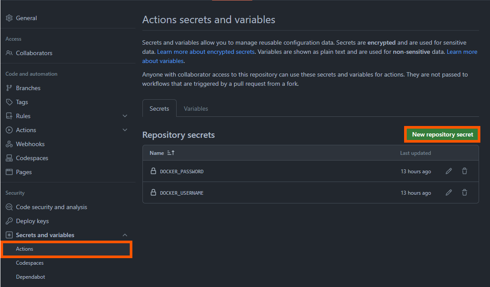

# Automated Docker Image Building with CI/CD Workflow Integration

Summary of the steps that one can take to create a Docker image  and integrate it into an existing CI/CD workflow. This guide will use GitHub Actions as the the continuous integration tool and is placed at [Github Action](https://github.com/arunp77/Job-Market-project/blob/main/.github/workflows/ci.yml).

## Steps

1. **DockerHub account creation:** Create a account at [Docker Hub](https://hub.docker.com/signup). Follow on screen descriptions. Choose Personal version. Verfiy the account creation at the email you registered for. If you have already created our account, login to the DOcker Hub account. 
2. **Generate Docker Access Token:** Navigate to the account settings. Go to the "Security" section and look for the option to generate an access token (Go to `My Profile > [Edit profile] > Security > Access Tokens > New Access Token`). It will ask you Access token description. In our case, I use `Job-Market-access-token` and then gave all the read, write, delete access. Then click generate the access token. 
   

   you must save the token at some safe place. It will be shown just once. 
3. **Setup GitHub Secrets:** Go to the Github repository. Next click settings tab and then 'Secrets and variables' (`setting > Secrets and variables > Actions`). Click on `New repository secret`. For the secret name, use `DOCKER_USERNAME` and for the secret value, paste your Docker Hub `username`. Repeat the above steps to add another secret named `DOCKER_PASSWORD`, using the Docker Hub access token as the secret value.
   
   

   Here the added secrets will be securely stored and accessible to the CI workflows in the `.github/workflows/ci.yml`. 

4. **Add Dockerfile:** Create a `Dockerfile` in the root directory for the project. This file contains instructions for building the Docker image, including setting up the environment and dependencies and it is named as [Dockerfile](Dockerfile) in the root directory. Let's explain the `Dockerfile` little bit:
    - `FROM python:3.10`: This will  create a new image based on Python version 3.10, which is currently the latest stable.
    - `WORKDIR /app`: This  sets the working directory of our container to `/app`, which is where we’ll put our application.
    - `COPY . /app`: This line copies the contents of the current directory  (where the Dockerfile is located) into `/app` directory inside the container. Here `.` represents the current directory, and `/app` is the destination directory inside the container. 
    -  `RUN pip install --no-cache-dir -r requirements.txt`: this line install all the dependencies specified in the `requirements.txt` file using `pip` where pip will not cache downloaded packages, which save disk space in the resulting Docker image.
    - `CMD ["python", "scripts/etl/etl_script.py"]`: line specifies the default command to run when container starts. It runs the python script `etl_scripts.py` relative to the working directory `/app`. This command will be executed automatically when a container based on the image is launched, unless overridden by specifying a different command at runtime. (Later we will create a `Application` with `setup.py` in the home directory where  we will call all functions).
|                                                       Note                                                            |
|-----------------------------------------------------------------------------------------------------------------------|
| Here `.github/workflows/ci.yml` file can access ad use secrets using `{{ secrets.SECRET_NAME }}` syntax. When secrets |
| are used in a workflow, their values are masked in the logs to prevent accidental exposure.                           |

5. 
Job-Market-Data-Engineering-Project/
│
├── .env                                      # to save the APIs secret keys and are ignored before pushing the files to GitHub via .gitignore
├── .github/
│   └── workflows/                            # Contains all the ci-cd yml and the Issue/bug files 
│       └── ci.yml                            # GitHub Actions workflow file
|── images /
├── scripts/
│   ├── web_scraping/
│   │   ├── adjurna.py
│   │   ├── muse.py  
│   │   └── requirements.txt                  # Depednent files
│   └── etl/
│       └── etl_script.py                     # The etl python file
│
├── data/
│   ├── scraped_data/
│   │   └── ajurna
│   │          └── ajurna_Json/ajurna_data.Json
│   │          └── ajurna_csv/ajurna_data.csv
│   │   └── muse/
│   │          └── muse_Json/muse_data.Json
│   │          └── muse_csv/muse_data.csv
│   └── processed_data/
│       └── (empty folder for storing processed data)
│
└── documentation/
    └── README.md
    └──  ProjectPlan.md
    └──  LICENSE.md
    └──  Contribution-guidelines.md
    └──  UserStories.md