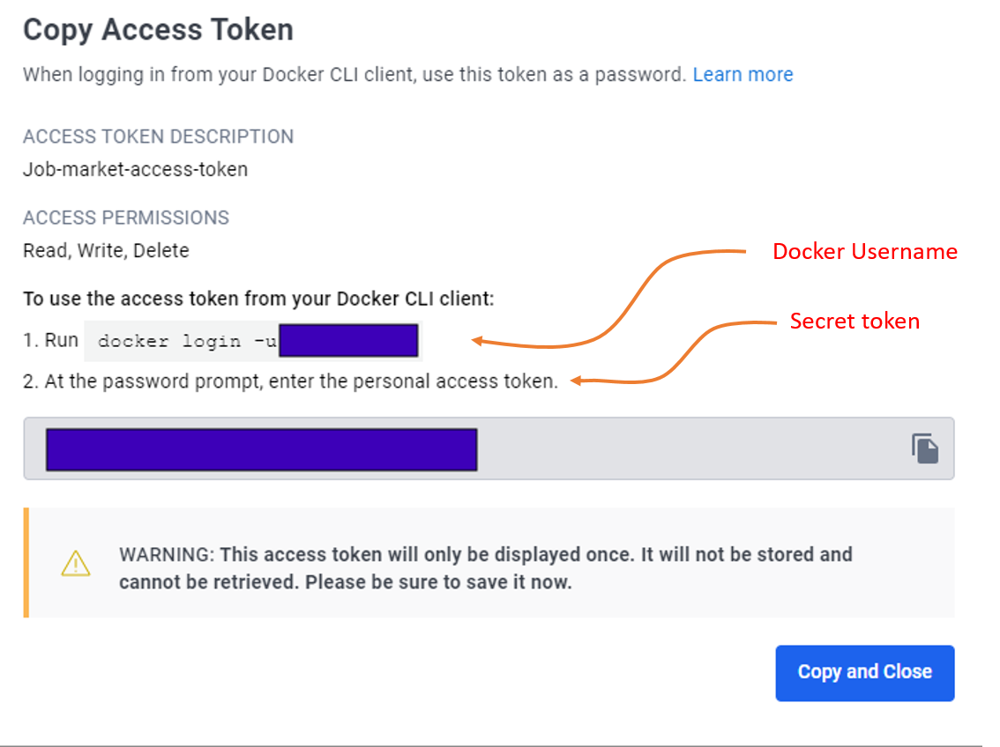
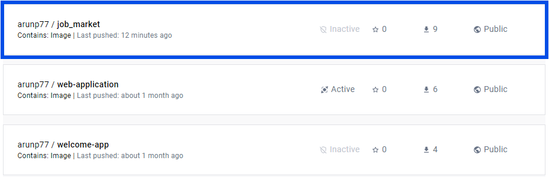

# Automated Docker Image Building with CI/CD Workflow Integration

Summary of the steps that one can take to create a Docker image  and integrate it into an existing CI/CD workflow. This guide will use GitHub Actions as the the continuous integration tool and is placed at [Github Action](https://github.com/arunp77/Job-Market-project/blob/main/.github/workflows/ci.yml).

## Prerequisites
- **Docker Installed:** Ensure that Docker is installed on your system. You can download and install Docker Desktop from the official Docker website [(https://www.docker.com/products/docker-desktop](https://www.docker.com/products/docker-desktop) or [Docker Desktop](https://docs.docker.com/desktop/install/windows-install/).
- **DockerHub account:** To manage and share Docker images, you'll need a Docker Hub account. If not already done, sign up for an account at [Docker Hub](https://hub.docker.com/signup) by following the on-screen instructions. Choose the Personal version and verify your account creation via the email you registered with. If you already have an account, simply log in to Docker Hub.
- **Dockerfile:** This file contains instructions for building the Docker image, including the base image, dependencies, and commands to run (discussed below).
- **Docker access token:** To build and push Docker images, you require a valid Docker ID, and an access token (discussed below).

## Steps to follow

1. **Generate Docker Access Token:** Navigate to the account settings. Go to the "Security" section and look for the option to generate an access token (Go to `My Profile > [Edit profile] > Security > Access Tokens > New Access Token`). It will ask you Access token description. In our case, I use `Job-Market-access-token` and then gave all the read, write, delete access. Then click generate the access token. 
   

   you must save the token at some safe place. It will be shown just once. 

2. **Setup GitHub Secrets:** Go to the Github repository. 
   - Next click settings tab and then 'Secrets and variables' (`setting > Secrets and variables > Actions`). 
   - Click on `New repository secret`. 
   - For the secret name, use `DOCKER_USERNAME` and for the secret value, paste your Docker Hub `username`. 
   - Repeat the above steps to add another secret named `DOCKER_PASSWORD`, using the Docker Hub access token as the secret value.
   
   

   Here the added secrets will be securely stored and accessible to the CI workflows in the `.github/workflows/ci.yml`. 

3. **Add Dockerfile:** Create a `Dockerfile` in the root directory for the project. This file contains instructions for building the Docker image, including setting up the environment and dependencies and it is named as [Dockerfile](Dockerfile) in the root directory. Let's explain the `Dockerfile` little bit:
    - `FROM python:3.10`: This will  create a new image based on Python version 3.10, which is currently the latest stable.
    - `WORKDIR /app`: This  sets the working directory of our container to `/app`, which is where we’ll put our application.
    - `COPY . /app`: This line copies the contents of the current directory  (where the Dockerfile is located) into `/app` directory inside the container. Here `.` represents the current directory, and `/app` is the destination directory inside the container. 
    -  `RUN pip install --no-cache-dir -r requirements.txt`: this line install all the dependencies specified in the `requirements.txt` file using `pip` where pip will not cache downloaded packages, which save disk space in the resulting Docker image.
    - `CMD ["python", "scripts/etl/etl_script.py"]`: line specifies the default command to run when container starts. It runs the python script `etl_scripts.py` relative to the working directory `/app`. This command will be executed automatically when a container based on the image is launched, unless overridden by specifying a different command at runtime. (Later we will create a `Application` with `setup.py` in the home directory where  we will call all functions).

   |                                                       Note                                                            |
   |-----------------------------------------------------------------------------------------------------------------------|
   | Here `.github/workflows/ci.yml` file can access ad use secrets using `{{ secrets.SECRET_NAME }}`                      |
   | syntax. When secrets are used in a workflow, their values are masked in the logs to prevent accidental exposure.      |

5. After including the Python dependencies in `requirements.txt`, completing the aforementioned steps,  the updates are pushed to the GitHub repository. This triggers the automatic generation and upload of Docker images directly to Docker Hub. You can access these Docker images here: [Docker images](https://hub.docker.com/repository/docker/arunp77/job_market/general). This streamlined process ensures that all files are kept up-to-date in the GitHub repository, while Docker images are seamlessly created.

6. In the `ci.yml` the following code snippet is added to enable access to Docker credentials and subsequently create and push Docker images to Docker Hub. The snippet is placed inside the `jobs` and steps:
   
   ```yaml
   - name: Login to Docker Hub
      uses: docker/login-action@v2
      with:
        username: ${{ secrets.DOCKER_USERNAME }}
        password: ${{ secrets.DOCKER_PASSWORD }}

    - name: Build Docker image
      run: docker build -t arunp77/job_market:latest .

    - name: Push Docker image
      run: |
         echo "${{ secrets.DOCKER_PASSWORD }}" | docker login -u "${{ secrets.DOCKER_USERNAME }}" --password-stdin
         docker push arunp77/job_market:latest
   ```

    This workflow triggers on pushes to the `main` branch, checks out the repository, logs in to Docker Hub using secrets for the Docker Hub username and password, builds the Docker image using the Dockerfile in the repository's root directory, and finally, pushes the built Docker image to the Docker Hub repository. 

    &emsp; **Note:** If you use tag 'Khushboo' or 'Brindha' in place of 'latest', it will create a new image with your tag.

7. **Creating a docker image directly into the Docker hub**:  
   - To build the docker image, navigate to the root directory of the project in the terminal and run
    ```bash
    docker build -t arunp77/job_market:latest .
    ```
   (Here tag `latest` in the repo arunp77/job-market is added.)

   

   It is to be  noted that, if there are any changes in this file then a new image should be built using above command.

   - To push the image:

        ```bash
        docker push arunp77/job_market:latest
        ```

8. **Run the Docker Container:** After building the Docker image, you can run a Docker container based on that image using the following command:
   
   ```bash
   docker run -d --name job-market-container -p 8000:8000 job-market
   ```

   Replace `8000:8000` with the appropriate port mapping if your FastAPI server runs on a different port. Here we expose 8000 port in Dockerfile 
   ```bash
   # Expose port 8000 to allow external access
   EXPOSE 8000
   ```
   If you don't add the `EXPOSE 8000` instruction in your `Dockerfile`, it won't prevent your FastAPI application from running within the Docker container. However, it will affect how you access the application from outside the container.

## Usage
This Docker image hosts the "Job Market" application. The application provides insights and analysis on job market data sourced from various sources. To use this Docker image, follow these steps:
1. **Pull the Docker Image**: Use the following command to pull the Docker image from Docker Hub:
    ```bash
    docker pull arunp77/job_market
    ```

2. **Run the Docker Container**: After pulling the image, run the Docker container using the following command:
    ```bash
    docker run -d -p 8080:80 arunp77/job_market
    ```

    Replace `8080` with the desired host port if you want to map it to a different port on your host machine.

3. **Access the Application**: Once the container is running, you can access the "Job Market" application by navigating to `http://localhost:8080` in your web browser.

## Configuration

This Docker image does not require any specific configuration. However, you can customize the application settings by providing environment variables when running the container.
-  View a summary of image vulnerabilities and recommendations → 
   ```bash
   docker scout quickview arunp77/job_market
   ```
- View vulnerabilities → 
  ```bash
  docker scout cves arunp77/job_market
  ```
- View base image update recommendations → 
  ```bash
  docker scout recommendations arunp77/job_market
  ```
- Include policy results in your quickview by supplying an organization → 
  ```bash
  docker scout quickview arunp77/job_market --org <organization>
  ```

## Dependencies

The application included in this Docker image is built using the following dependencies:
- Python 3.x
- Flask
- Pandas
- NumPy
- Matplotlib
- Seaborn
- Plotly
- Scikit-learn
- BeautifulSoup
- Requests


## References
- [Docker for Machine Learning Engineers](https://www.realworldml.net/blog/docker-for-machine-learning-engineers?s=03)