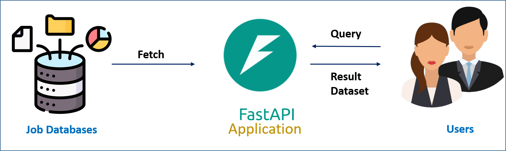

# InsightfulRecruit: Unveiling the Job Market Landscape through Data Engineering

[](https://github.com/arunp77/Job-Market-project) 
 
 

[](https://github.com/arunp77/Job-Market-project/blob/main/README.md)


## Overview

This project aims to showcase skills in data engineering by gathering and analyzing job market data from various sources. By the end of the project, we aim to have a clearer understanding of the job market, including sectors with the highest demand, required skills, active cities, and more.


## Prerequisite
- **WebScrapping:** BeautifulSoup, Selenium
- **Python:** -3.10.x
- **NoSQL:** ElasticSearch 
- **Docker Compose:** Docker v2.15.1
- **API:** fastAPI

## Setup Instructions

1. **Clone the repository:** Clone this `Job-Market-project` repository to your local machine using Git:
   ```bash
   git clone https://github.com/arunp77/Job-Market-Project.git
   ```
2. **Navigate to the project directory:** Change your current directory to Job-Market-project:
   ```bash
   cd Job-Market-Project
   ```
3. **Set Up Virtual Environment (Optional):** It's a good practice to work within a virtual environment to manage dependencies. In our case, we have created a Python virtual environment using `virtualenv` (which can be installed through `pip install virtualenv`) or `conda`:
   ```bash
   # Using virtualenv
   python -m venv env
   # activate the enviornment
   source env/bin/activate     # in mac
   env\Scripts\activate        # in windows using Command Prompt
   .\env\Scripts\Activate.ps1  # in windows using powershell
   
   # Using conda
   conda create --name myenv
   conda activate myenv
   ```
   **Deactivate the Virtual Environment:** When you're done working on your project, you can deactivate the virtual environment to return to the global Python environment.
   ```bash
    deactivate
   ```
   
5. **Install Dependencies:** Install the required Python packages specified in the requirements.txt file:
   ```bash
   pip install -r requirements.txt
   ```

6. **Access the databases on Elasticsearch:** Please see below for more details ([Go to Elasticsearch Integration](#elasticsearch-integration)). To run the elasticsearch, we must have `elasticsearch` python clinet installed. Next run the [docker-compose.yml](docker-compose.yml) first using (detached mode)
    ```bash
    docker-compose up -d
    ```
    and then run the `db_connection.py` file to integration the elasticsearch using
    ```bash
    python db_connection.py
    ```
    - So the Elasticsearch runs at port: [http://localhost:9200/](http://localhost:9200/)
    - So the Kibana runs at port: [http://localhost:5601/](http://localhost:5601/)

    Here it should be noted that `db_connection.py` script is responsible for establishing a connection to Elasticsearch and loading data into it. 

7. **Deployment: FastAPI:** Our FastAPI is created using the `api.py` script available in the repository. In our case the FASTApi server runs at [http://localhost:8000/](http://localhost:8000/) (for more details see [FASTApi section below](#fast-api)). To start the FastAPI server, we can use the following command:

   ```bash
   uvicorn api:api --host 0.0.0.0 --port 8000
   ```

   or 
   ```bash
   uvicorn api:api --reload
   ```
   enables automatic reloading of the server whenever the source code changes. For more details on each endpoint and how to interact with the API
   - `docs_url`: Specifies the URL path where the OpenAPI (Swagger UI) documentation will be available. By default, it's set to /docs and can be accessed at [http://localhost:8000/api/docs](http://localhost:8000/api/docs)
   - `redoc_url`: Specifies the URL path where the ReDoc documentation will be available. By default, it's set to /redoc and can be accessed to [http://localhost:8000/api/redoc](http://localhost:8000/api/redoc).

   
8.  **Compile and Run the Project:** Once your FastAPI application is running, we can access it in our browser by navigating to `http://localhost:8000` (assuming we're running it locally).

## Project structure:

```
Job-Market-project/
│
├── .env                                        # Environment variables file
├── .github/
│   └── workflows/                              # GitHub Actions workflow directory
│       └── ci.yml                              # CI/CD workflow file
├── images/                                     # Directory for image files
├── scripts/                                    # Directory for scripts
│   ├── web_scraping/                          # Directory for web scraping scripts
│   │   ├── adjurna.py                          # Script for Adjurna data extraction
│   │   ├── muse.py                             # Script for Muse data extraction
│   │   └── ss.py                               # Script for Stepstone data extraction
│   ├── etl/                                    # Directory for ETL scripts
│   │   └── etlscript.py                        # ETL script
│   ├── database/                               # Directory for database scripts
│   │   └── db_connection.py                    # Database connection script
│   └── plot_analysis/                         # Directory for plot analysis scripts
│        └── uscase.py                          # Use case plot analysis script
├── data/                                      # Directory for data
│   ├── scraped_data/                          # Directory for scraped data
│   │   ├── adjurna/                           # Directory for Adjurna data
│   │   │   └── csv/                           # Directory for CSV files
│   │   │       └── adzuna_scrapped_data.csv   # Adjurna scraped data file
│   │   ├── muse/                              # Directory for Muse data
│   │   │   └── csv/                           # Directory for CSV files
│   │   │       └── muse_scrapped_data.csv     # Muse scraped data file
│   │   └── ss/                                # Directory for Stepstone data
│   │       └── ss_datascience_germany_20240221.csv # Stepstone data file
│   └── processed_data/                        # Directory for processed data
│       ├── adjurna_processed_data/            # Directory for processed Adjurna data
│       │   └── adzuna_scrapped_data.csv       # Processed Adjurna data file
│       ├── muse_processed_data/               # Directory for processed Muse data
│       │   └── muse_scrapped_data.csv         # Processed Muse data file
│       └── ss_processed_data/                 # Directory for processed Stepstone data
│           └── ss_datascience_germany_20240221.csv # Processed Stepstone data file
├── api.py                                     # FASTApi
├── README.md                                  # Readme file
├── ProjectPlan.md                             # Project plan file
├── LICENSE.md                                 # License file
├── Contribution-guidelines.md                 # Contribution guidelines file
└── UserStories.md                             # User stories file
```

## Elasticsearch Integration <a name="elasticsearch-integration"></a>

In this project, we utilize Elasticsearch as our primary database solution for efficient storage, retrieval, and analysis of structured and unstructured data. Elasticsearch is a distributed, RESTful search and analytics engine designed for horizontal scalability, real-time search, and robust analytics capabilities. Elasticsearch proves invaluable in situations requiring full-text search, real-time indexing, scalability, and advanced analytics capabilities. Here python is utilized for seamless interaction with Elasticsearch by leveraging the `elasticsearch` Python client library. We can install the `elasticsearch` module using the following command in your terminal or command prompt:
```bash
pip install elasticsearch
```
- The `db_connection.py` script demonstrates how Python code can be written to establish connections to Elasticsearch, perform data operations, and integrate Elasticsearch functionality into our project workflow effectively.
- Docker plays a crucial role in our project by facilitating the containerization of Elasticsearch and simplifying the management of deployment environments. 
- The [docker-compose.yml](docker-compose.yml) file defines the Docker services required for running [Elasticsearch](https://www.elastic.co/guide/en/elasticsearch/reference/master/docker.html#docker) and Kibana within isolated containers.
  - **Docker Images used for the Elasticsearch:** [Elasticsearch](https://www.docker.elastic.co/r/elasticsearch) 
  - **Docker Images used for the Kibana:** [Kibana](https://www.docker.elastic.co/r/kibana/kibana:8.1.2) 
- Docker Compose orchestrates the deployment of these services, ensuring consistent and reproducible environments across different development and deployment stages. By containerizing Elasticsearch, we achieve greater portability, scalability, and ease of deployment, making it convenient to deploy our Elasticsearch infrastructure in various environments with minimal configuration.

## Docker Images

We also maintain a Docker image for our project, available on Docker Hub at [arunp77/job_market](https://hub.docker.com/r/arunp77/job_market), ensuring accessibility and easy deployment. For more details, in what way we planned our project Docker image, please see [docker-image integration](Docker-image-integration.md).


## FASTApi deployment <a name="fast-api"></a>
- The first step is to install the `fastapi` and `uvicorn` libraries. `uvicorn` is a library that allows us to launch the server created by FastAPI. 
- We need an [Asynchronous Server Gateway Interface](https://asgi.readthedocs.io/en/latest/) (ASGI server), for production such as [Uvicorn](https://www.uvicorn.org/) or [Hypercorn](https://github.com/pgjones/hypercorn), but we choose uvicorn to deploy on a local machine.

- To install `fastapi` and `uvicorn` libraries:
  ```bash
  pip install fastapi uvicorn
  ```

   
  
## Contributors
This project is a group effort and would not have been possible without the help of these contributors:

- [Arun Kumar Pandey](https://github.com/arunp77): [Email to Arun](arunp77@gmail.com)
- [Brindha Sadayappan](https://github.com/brindha311): [Email to Brindha](brindha311@gmail.com)
- [Khushboo Goyal](https://github.com/khushboo026): [Email to Khusboo](khushboo026@gmail.com)
- **Cohort:** [Vincent](https://github.com/AtoutPillard)

## Feedback and Contributions

Feedback and contributions are welcome! Please open an issue or create a pull request if you have any suggestions or improvements. [Contribution guidelines](Contribution-guidelines.md)

## License

This project is licensed under the [GNU General Public License v3.0](LICENSE).

## Demo video

Check out this video I uploaded to YouTube. In this video, I have shown a step-by-step demo for the project:

<div style="border: 1px solid red; padding: 10px;">
  <a href="https://www.youtube.com/watch?v=6GZUVTkPpHA">
    
  </a>
</div>


<!--------reference: https://github.com/kevAnto/fast-API/tree/main>------>

## Launch on Binder
  [](https://mybinder.org/v2/gh/arunp77/Job-Market-project/main)
