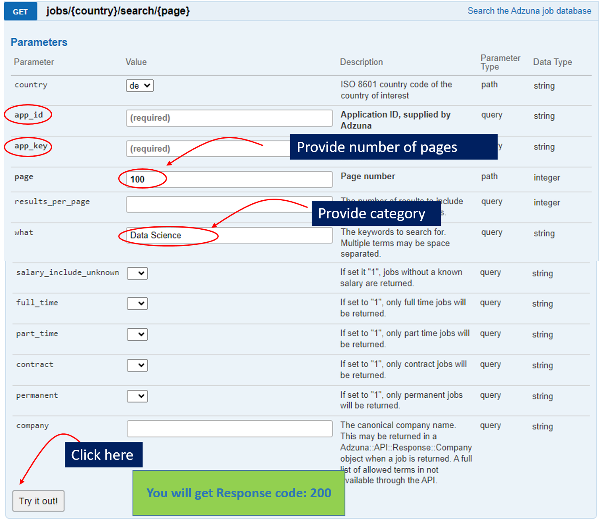
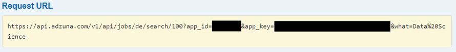
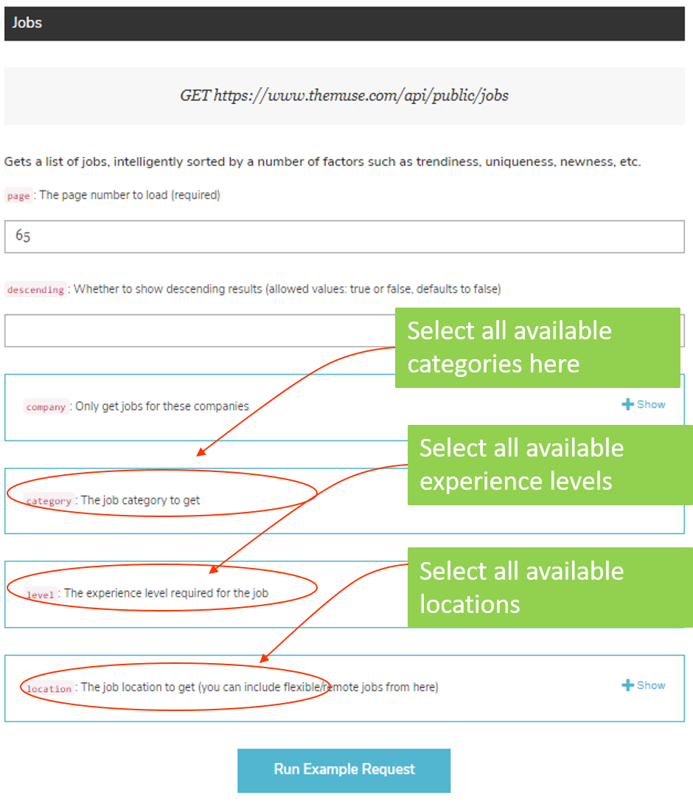

# Data Extraction via API

This repository contains python scripts in `scripts/web_scraping/` for extracting job listings from the German market in the data science category using APIs provided by [Adzuna](https://developer.adzuna.com/) and [The Muse](https://www.themuse.com/developers/api/v2).

## Usage

1. **Obtain API Credentials**:
   - **Create accounts on the respective platforms:** Provide the required information to register for an account on the respective platforms. Upon completing the registration process, an email containing an authorization link will be sent to your registered email address. Click the link received in the email to authorize and activate your account.
     - [Adzuna Developer Portal](https://developer.adzuna.com/signup)
     - [The Muse Developer Portal](https://www.themuse.com/developers/api/v2)
    
   - Retrieve API credentials (API keys, tokens, etc.) from the platforms.
     - In the case of Muse, you need to get the `API Key`, available at [api key link](https://www.themuse.com/developers/api/v2/apps).
     - In the case of Adzuna, you need to obtain the '**Application ID**' and '**Application keys**' and save them into a `.env` file in your local home directory of the project as follows: `APP_ID` and `API_KEY2`, respectively (for more details, see [Documentation page](https://developer.adzuna.com/overview)). TO get these two, you need to go to `Dashboard>> Application Access Details`.
     - Remember to add the `.env` file to `.gitignore` to avoid sharing these sensitive data publicly.
2. **Getting data:**
   - **In the case of Adzuna:** Open the [interactive endpoint documentation page](https://developer.adzuna.com/activedocs) and fill out the details. Every time you make a query the response is returned as an object serialised using `JSON`, `JSONP` or `XML` encoding. For example, you need to provide 
    
    and then click the button at the button `Try  it out`. You will a request URL that looks like:
    

    - **In the case of Muse:** It is to be noted here that there, it always return data in `JSON` format. Also this api allow you to make up to 3600 requests per hour. Without `api_key`, only 500 requests per hour is allowed. To monitor your usage relative to the limit, the following HTTP headers will be returned with every response: `X-RateLimit-Remaining`, `X-RateLimit-Limit` and `X-RateLimit-Reset`. Ensure to handle these rate limits appropriately in your application to avoid exceeding the allowed quotas. To avoid rate limit errors when using The Muse API, it's crucial to register your app and obtain an API key to increase your request quota to 3600 per hour. Monitor the rate limit headers returned with each response and implement backoff mechanisms in case of errors. Additionally, consider caching responses and optimizing requests to minimize the frequency of API calls and ensure smooth operation of your application. Similar to the Adzuna, provide the details and get the request URL.
  
        

3. **Request URL:** In the last step, we will get the request url. These request URLs will be used in the pythons files in the `scripts/web_scraping` directory.

4. **Run the Script**:
   - Customize the endpoints as per your requirements.
   - Run the script for each case.

5. **Data Extraction**:
   - The script will fetch job listings data from the specified endpoints.
   - Data will be saved in a structured format (CSV, and JSON) for further analysis.
   - For our current work, we just utilize the csv file for our analysis.